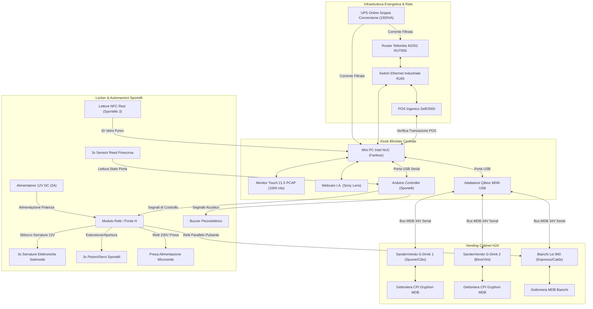

# 📋 Inventario Ufficiale Hardware & Cablaggio — Toscanaccio H24

Questo documento costituisce la distinta base hardware (Bill of Materials) ufficiale e la guida alle specifiche di cablaggio e connettività per la realizzazione fisica del punto vendita automatizzato **Toscanaccio — Gastronomia & Vending H24** a Livorno. 

L'infrastruttura integra la cassa Kiosk Touchscreen centrale con i distributori automatici **SandenVendo G-Drink** (Cibo e Bevande Fredde), la macchina da caffè super-automatica **Bianchi Lei 900** (Bevande Calde) e il sistema di **Sportelli Automatizzati & Locker Resi Pyrex** controllato tramite Arduino.

---

## 🗺️ Schema di Collegamento Fisico (Rete, Bus MDB & Automazioni)

---

## 📦 Lista Articoli Hardware (Bill of Materials)

### 1. Unità di Controllo, Interfaccia Utente (Kiosk) & Automazioni

| Componente | Specifica Tecnica Consigliata | Brand/Modello di Riferimento | Q.tà | Scopo e Note |
| :--- | :--- | :--- | :---: | :--- |
| **Mini PC Kiosk Controller** | Intel Core i3/i5 (fanless), 8GB DDR4 RAM, 128GB SSD NVMe, alimentazione DC 12-19V, range operativo esteso (-20°C a 60°C). | *ASUS PL64 Fanless* o *Intel NUC Industrial* | 1 | Esegue il backend FastAPI (Python), la cassa web locale e gestisce le transazioni POS, comandi MDB e comunicazione seriale Arduino. |
| **Monitor Touchscreen Industriale** | 21.5" o 27" Full HD, tecnologia Capacitiva Retroproiettata (PCAP, multi-touch 10 tocchi), luminosità minima **1000 nits** (leggibile al sole), vetro temperato **IK10** antivandalo, frontale **IP65** (impermeabile). | *Elo Touch Open Frame* o *Faytech PCAP Monitor* | 1 | Interfaccia principale per la navigazione dei ripiani H24, l'assortimento del carrello, acquisto servizi e resi Pyrex. |
| **Microcontrollore Sportelli** | Arduino Uno Rev3 o Arduino Nano con cavo USB schermato. | *Arduino Uno R3* / *Arduino Nano* | 1 | Riceve comandi da PC via seriale per azionare serrature, pistoni, buzzer e leggere lo stato dei finecorsa degli sportelli. |
| **Serrature di Sicurezza** | Serratura elettronica a solenoide 12V DC, forza di tenuta min. 150 kg, normalmente chiusa (rimane bloccata in assenza di corrente). | *Serrature Solenoide 12V YLI* | 3 | Assicurano il blocco fisico dello sportello Microonde (1), Acqua Calda (2) e Resi Pyrex (3). |
| **Attuatori di Apertura** | Servomotori ad alta coppia (min. 20 kg/cm) o mini attuatori lineari elettrici 12V DC (corsa 50mm). | *Attuatori lineari 12V DC* / *Servo DS3218* | 3 | Spingono fisicamente all'esterno lo sportello corrispondente dopo lo sblocco della serratura. |
| **Sensori Finecorsa** | Interruttori magnetici di sicurezza (sensori Reed) o micro-interruttori meccanici a levetta. | *Sensori Reed Magnetici MC-38* | 3 | Rilevano la chiusura fisica degli sportelli per informare il backend e riagganciare la serratura di sicurezza. |
| **Modulo Relè / Driver** | Modulo Relè optoisolato a 4 o 8 canali 5V (attivazione a livello basso) o scheda driver MOSFET. | *Modulo Relè 8 Canali Arduino* | 1 | Interfaccia di potenza per controllare serrature 12V, motori e il relè presa del microonde. |
| **Relè di Potenza Microonde** | Relè a stato solido (SSR) o contattore 230V AC - minimo 16A, montaggio su barra DIN. | *Relè Stato Solido SSR-25DA 25A* | 1 | Abilita/disabilita in sicurezza l'alimentazione a 230V del forno a microonde. |
| **Alimentatore Ausiliario** | Alimentatore switching industriale 12V DC, potenza minima 36W (3A), montaggio barra DIN. | *Mean Well HDR-30-12* | 1 | Fornisce energia a 12V per le serrature a solenoide e i pistoni di apertura degli sportelli. |
| **Buzzer di Allerta** | Buzzer piezoelettrico attivo 5V DC. | *Piezo Buzzer Attivo 5V* | 1 | Genera i segnali acustici intermittenti durante gli ultimi 30 secondi di riscaldamento del microonde. |
| **Lettore NFC Resi** | Lettore/Scrittore RFID/NFC USB, frequenza 13.56 MHz, compatibile ISO/IEC 14443A. | *Lettore NFC ACR122U USB* | 1 | Posizionato all'interno dello Sportello 3 (Resi) per leggere il tag NFC nel tappo del Pyrex. |
| **Contenitore Resi Autolivellante** | Cesto in plastica o carrello di raccolta con fondo mobile a molle di compressione calibrate (auto-livellamento in base al peso). | *Carpenteria Custom con Molle* | 1 | Alloggiato sotto lo scivolo in acciaio dello Sportello 3 per accogliere i Pyrex in modo ammortizzato ed evitarne la rottura. |

---

### 2. Interfacce Vending & Bus MDB

| Componente | Specifica Tecnica Consigliata | Brand/Modello di Riferimento | Q.tà | Scopo e Note |
| :--- | :--- | :--- | :---: | :--- |
| **Adattatore USB-MDB Master** | Interfaccia hardware di conversione bidirezionale da protocollo USB (virtual COM in ASCII/Hex) a Bus seriale MDB (34VDC). Alimentato direttamente dal bus MDB o via USB. | *Qibixx MDB-USB Master/Slave* | 1 | Consente al Mini PC di interfacciarsi come "Master" o "Cashless" sul bus delle macchine per inviare comandi di erogazione e crediti. |
| **Cablaggio Bus MDB** | Cavo schermato specifico per vending, connettori MDB standard maschio/femmina a 6 pin, cablaggio a margherita (Daisy Chain). | *Cablaggio Vending Standard* | 3 | Collega fisicamente in serie la gettoniera del SandenVendo 1, del SandenVendo 2 e della Bianchi Lei 900 all'adattatore USB-MDB. |

---

## ⚡ Linee Guida per il Cablaggio & Installazione sul Campo

### 1. Cablaggio e Sicurezza Elettrica del Forno a Microonde
Il microonde assorbe picchi di circa 1000W-1200W durante il funzionamento.
* > [!IMPORTANT]
  > **Isolamento della linea di potenza**: La linea a 230V comandata dal relè del microonde deve essere dotata di un proprio **interruttore magnetotermico da 10A dedicato** all'interno del quadro elettrico del locale. Non collegare mai la presa del microonde sotto la stessa presa passante del Mini PC o del Touchscreen per evitare interferenze o blackout protettivi dell'UPS.
* > [!WARNING]
  > **Diodi di ricircolo**: Sulle bobine di tutte le serrature a solenoide 12V devono essere saldati in parallelo dei **diodi di ricircolo (tipo 1N4007)** con polarità invertita (catodo sul positivo). Questo previene i picchi di extra-tensione induttiva che potrebbero danneggiare i relè e causare il crash o il riavvio dell'Arduino per rumore elettromagnetico (EMF).

### 2. Protezione dalle Interferenze (Bianchi Lei 900 & Frigo)
La Bianchi Lei 900 monta al suo interno bobine e teleruttori per la gestione dei macinacaffè e pompe che generano picchi elettromagnetici sulla linea elettrica e nell'aria.
* > [!IMPORTANT]
  > **Isolamento delle tratte dati**: I cavi dati (Ethernet Cat6 SFTP, cavi USB-MDB e il cavo USB schermato dell'Arduino) **non devono mai scorrere nelle stesse canaline o tubazioni dei cavi elettrici a 230V** dei distributori o della presa del microonde. Mantenere una distanza minima di 15-20 cm.
* > [!TIP]
  > **Messa a terra comune**: Assicurarsi che i telai metallici dei SandenVendo, della Bianchi Lei 900, del Kiosk centrale e dello scivolo in acciaio dei resi Pyrex siano collegati alla stessa barra di messa a terra dell'edificio per azzerare le correnti vaganti ed evitare letture errate sui sensori Reed e sul lettore NFC.
