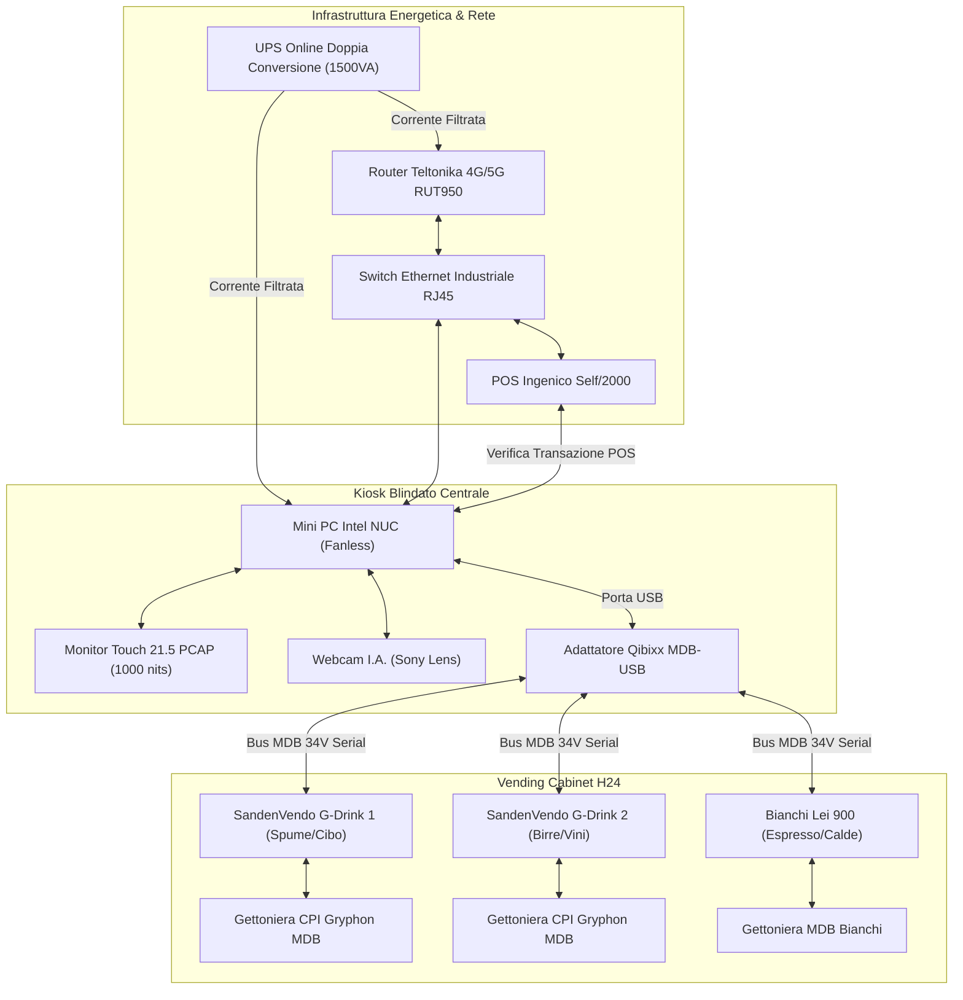

# 📋 Inventario Ufficiale Hardware & Cablaggio — Toscanaccio H24

Questo documento costituisce la distinta base hardware (Bill of Materials) ufficiale e la guida alle specifiche di cablaggio e connettività per la realizzazione fisica del punto vendita automatizzato **Toscanaccio — Gastronomia & Vending H24** a Livorno. 

L'infrastruttura integra la cassa Kiosk Touchscreen centrale con i distributori automatici **SandenVendo G-Drink** (Cibo e Bevande Fredde) e la macchina da caffè super-automatica **Bianchi Lei 900** (Bevande Calde).

---

## 🗺️ Schema di Collegamento Fisico (Rete & Bus MDB)

---

## 📦 Lista Articoli Hardware (Bill of Materials)

### 1. Unità di Controllo & Interfaccia Utente (Kiosk)

| Componente | Specifica Tecnica Consigliata | Brand/Modello di Riferimento | Q.tà | Scopo e Note |
| :--- | :--- | :--- | :---: | :--- |
| **Mini PC Kiosk Controller** | Intel Core i3/i5 (fanless), 8GB DDR4 RAM, 128GB SSD NVMe, alimentazione DC 12-19V, range operativo esteso (-20°C a 60°C). | *ASUS PL64 Fanless* o *Intel NUC Industrial* | 1 | Esegue il backend FastAPI (Python), la cassa web locale e gestisce le transazioni POS e i comandi MDB. |
| **Monitor Touchscreen Industriale** | 21.5" o 27" Full HD, tecnologia Capacitiva Retroproiettata (PCAP, multi-touch 10 tocchi), luminosità minima **1000 nits** (leggibile al sole), vetro temperato **IK10** antivandalo, frontale **IP65** (impermeabile). | *Elo Touch Open Frame* o *Faytech PCAP Monitor* | 1 | Interfaccia principale per la navigazione dei ripiani H24, l'assortimento del carrello e il pagamento contactless. |
| **Telaio Blindato da Incasso** | Acciaio zincato da 2.5 mm, serratura a doppia mappa blindata, griglie di aerazione con filtri anti-polvere, predisposizione flangia da vetrina. | *Carpenteria Metallica Personalizzata* | 1 | Alloggiamento di sicurezza da incassare nella vetrina del locale per proteggere il retro del monitor e il Mini PC da furti ed effrazioni. |
| **Webcam Visione I.A.** | Risoluzione Full HD (1080p), obiettivo grandangolare da 100° senza distorsione, sensore CMOS Sony (ottima sensibilità notturna), connessione USB 2.0. | *ELP USB Camera Module (Sony IMX323)* | 1 | Posizionata sul soffitto del vano cassa/Kiosk per inquadrare i prodotti presentati e inviare i fotogrammi a MobileNet per il controllo I.A. |

---

### 2. Interfacce Vending & Bus MDB

| Componente | Specifica Tecnica Consigliata | Brand/Modello di Riferimento | Q.tà | Scopo e Note |
| :--- | :--- | :--- | :---: | :--- |
| **Adattatore USB-MDB Master** | Interfaccia hardware di conversione bidirezionale da protocollo USB (virtual COM in ASCII/Hex) a Bus seriale MDB (34VDC). Alimentato direttamente dal bus MDB o via USB. | *Qibixx MDB-USB Master/Slave* | 1 | **Fondamentale.** Consente al Mini PC di interfacciarsi come "Master" sul bus delle macchine per inviare i comandi di erogazione e leggere lo stato delle gettoniere. |
| **Cablaggio Bus MDB** | Cavo schermato specifico per vending, connettori MDB standard maschio/femmina a 6 pin, cablaggio a margherita (Daisy Chain). | *Cablaggio Vending Standard* | 3 | Collega fisicamente in serie la gettoniera del SandenVendo 1, del SandenVendo 2 e della Bianchi Lei 900 all'adattatore USB-MDB. |

---

### 3. Infrastruttura di Connettività & Rete

| Componente | Specifica Tecnica Consigliata | Brand/Modello di Riferimento | Q.tà | Scopo e Note |
| :--- | :--- | :--- | :---: | :--- |
| **Router LTE Industriale** | Connettività 4G LTE Cat 4 (fino a 150 Mbps), doppia slot SIM (failover automatico tra operatori diversi), scocca in alluminio, range di temperatura esteso, porta antenna SMA. | *Teltonika RUT240* o *RUT950* | 1 | Garantisce la connessione internet H24 protetta per l'autorizzazione POS bancaria e l'invio delle notifiche SMS/WhatsApp. |
| **Antenna Esterna LTE** | Antenna omnidirezionale a fungo o a pannello MIMO per esterno, montaggio a parete o a palo, certificata IP67, cavo a bassa perdita da 3 metri. | *Poynting OMNI-280* | 1 | Installata all'esterno del locale per superare la schermatura dei muri e dei vetri antisfondamento, assicurando un segnale 4G/5G stabile. |
| **Switch Ethernet Industriale** | 5 o 8 porte RJ45 10/100/1000 Mbps, montaggio su barra DIN, case metallico fanless IP30, protezione da scariche elettrostatiche. | *MikroTik SOHO* o *TP-Link LiteWave Industriale* | 1 | Collega in rete LAN protetta il Mini PC, il POS contactless Ingenico e le telecamere di sicurezza. |
| **Cavi di Rete Schermati** | Cavo Ethernet **Cat. 6 SSTP/SFTP** doppia schermatura (treccia + foglio di alluminio), conduttori in rame puro, guaina resistente agli UV ed esterno. | *Cavi Cat6 SFTP Schermati* | 4 | **Critico.** Previene le interferenze elettromagnetiche indotte dai motori della Bianchi Lei 900 e dai compressori dei frigo SandenVendo. |

---

### 4. Protezione Elettrica & Continuità (UPS)

| Componente | Specifica Tecnica Consigliata | Brand/Modello di Riferimento | Q.tà | Scopo e Note |
| :--- | :--- | :--- | :---: | :--- |
| **Gruppo di Continuità (UPS)** | Potenza **1500VA / 1350W**, tecnologia **Online a Doppia Conversione** (VFI - Voltage and Frequency Independent), onda sinusoidale pura filtrata a zero millisecondi di tempo di commutazione, batterie Hot-Swap. | *Riello Sentinel Pro SEP 1500* o *APC Smart-UPS SRT 1500VA* | 1 | **Essenziale.** Alimenta il Mini PC, il Touchscreen, il POS Ingenico e il Router. Elimina sbalzi di tensione e assicura l'operatività del POS e lo spegnimento guidato del PC (salvaguardia DB) in caso di blackout. |

---

## ⚡ Linee Guida per il Cablaggio & Installazione sul Campo

### 1. Protezione dalle Interferenze (Bianchi Lei 900 & Frigo)
La Bianchi Lei 900 monta al suo interno bobine e teleruttori per la gestione dei macinacaffè, dei mixer dei solubili e delle caldaie. Queste componenti generano spike elettromagnetici sulla linea elettrica e nell'aria.
- > [!IMPORTANT]
  > **Isolamento delle tratte**: I cavi dati (Ethernet Cat6 SFTP e USB-MDB) **non devono mai scorrere nelle stesse canaline o tubazioni dei cavi elettrici a 230V** dei distributori. Mantenere una distanza minima di 15-20 cm per evitare corruzione dei pacchetti dati e disconnessioni del touch.
- > [!TIP]
  > **Messa a terra comune**: Assicurarsi che i telai metallici dei SandenVendo, della Bianchi Lei 900 e del Kiosk centrale siano collegati alla stessa ed identica barra di messa a terra del negozio per evitare differenze di potenziale sul bus dati MDB.

### 2. Dimensionamento Elettrico per il Punto Vendita
Per calcolare il carico di corrente del locale H24 (esclusi condizionatore ed illuminazione):
- **SandenVendo G-Drink 1 & 2**: Consumo medio di picco (fase sbrinamento/compressore avviato): ~500W ciascuno.
- **Bianchi Lei 900**: Consumo di picco (caldaia in riscaldamento + pompe): **~1800W**.
- **Kiosk & POS (sotto UPS)**: Consumo stimato di picco: ~150W.
- **Totale di Picco**: **~2950W** (pari a circa 13 Ampere).
  - *Raccomandazione*: La linea elettrica del negozio deve essere dimensionata per supportare una potenza minima di **4.5 kW o 6 kW contrattuali** con interruttori magnetotermici separati per ciascun distributore automatico e per la linea protetta sotto UPS.
